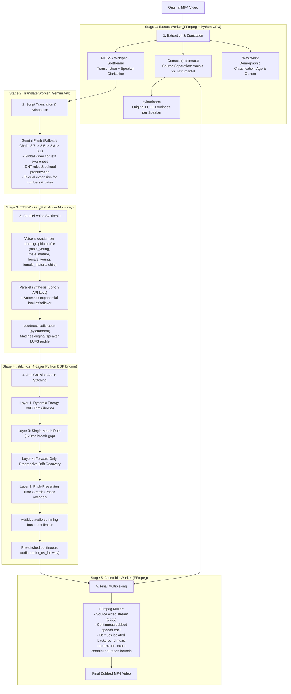

# 🎙️ Doblador - Autonomous AI Audiovisual Dubbing System

An end-to-end autonomous audiovisual dubbing platform that converts spoken videos in any language into natural, **temporally aligned** dubbed videos in Spanish (or other target languages). It preserves the original background music and sound effects while dynamically allocating cloned voices tailored to the age and gender of each detected speaker.

The pipeline maintains container synchronization (audio-to-timestamp alignment without altering the original video track).

---

## 📐 System Architecture



---

## 🧠 Artificial Intelligence Models in the Pipeline

| Model / Tool | Role / Purpose | Architecture / Type | Quantization / Weight | Runtime Device |
|---|---|---|---|---|
| **MOSS-Transcribe-Diarize** | Single-pass STT + Speaker Diarization | Audio-LLM (0.9B) | `Q5_K_M.gguf` (~667 MB) | GPU (Vulkan / GGML) |
| **Sortformer v2.1** | Multi-speaker diarization for up to 4 speakers (fallback) | Streaming Diarization Transformer | `Q8_0.gguf` (~17 MB) | GPU (Vulkan / GGML) |
| **faster-whisper (base)** | Multilingual automatic speech recognition (fallback) | Encoder-Decoder Transformer | `float16` / `int8` (~140 MB) | GPU (CUDA) / CPU |
| **Wav2Vec2 Age & Gender** | Gender (M/F/Child) and biological age classification | `wav2vec2-large-robust` (audEERING) | FP32 PyTorch (~1.2 GB) | CPU / GPU |
| **Demucs (htdemucs)** | Deep source separation (isolates vocals, preserves music/SFX) | Hybrid Spectrogram Waveform U-Net | FP32 PyTorch (~80 MB) | GPU (CUDA) / CPU |
| **Google Gemini Flash** | Context-aware translation & script adaptation | Multimodal Cloud LLM | `gemini-3.7-flash` (fallback to 3.5, 3.8, 3.1) | Cloud API |
| **Fish Audio (s2.1-pro-free)** | Neural voice synthesis with timbre cloning | Latent Zero-shot TTS | Remote neural engine | Cloud API (Multi-Key) |
| **pyloudnorm** | Perceptual volume calibration | ITU-R BS.1770-4 (EBU R128) | Numerical DSP | CPU |
| **Librosa DSP** | Energy VAD trimming & pitch-preserving time-stretching | Phase Vocoder + Energy VAD | Algorithmic DSP | CPU |

---

## ⚡ Core Engineering Innovations

### 1. 4-Layer Anti-Collision Audio Stitcher (`/stitch-tts`)
Places each synthesized TTS segment at its **original timestamp**, solving voice overlaps and cumulative timing drift:
- **Layer 1 (Dynamic VAD Trim)**: Identifies precise speech boundaries using `librosa.effects.trim(top_db=25)` to eliminate variable TTS padding without clipping words.
- **Layer 2 (Baseline Time-Stretch)**: Phase vocoder time-stretching via `librosa.effects.time_stretch` adapts clip length to fit the dialogue slot while preserving original vocal pitch.
- **Layer 3 (Strict Single-Mouth Rule - Zero Same-Speaker Overlap)**: Every speaker is tracked independently (`speaker_last_end_ms[spk]`). A speaker **CAN NEVER** begin a new phrase until their previous phrase has completely ended, guaranteeing a minimum natural breathing gap of **+70 ms**. Different speakers can naturally overlap or interrupt each other, summing on the additive bus.
- **Layer 4 (Forward-Only Progressive Drift Recovery)**: Drift is never recovered by snapping timestamps backward onto already playing audio. Instead, it recovers forward by proportionally accelerating subsequent clips (up to 1.35x `atempo`) to absorb delay in natural dialogue pauses.
- **Additive Bus with Soft-Knee Limiter**: Segments are summed onto the bus (`+=`). Peaks exceeding the knee (0.80) are smoothly compressed via `tanh` up to 0.98, leaving the rest of the audio bit-identical.

### 2. Multi-Key Parallel Voice Synthesis with Failover (Fish Audio)
- Supports multiple API keys via `FISH_AUDIO_API_KEY`, `FISH_AUDIO_API_KEY_2`, and `FISH_AUDIO_API_KEY_3`, or comma-separated lists.
- Dispatches across **6 parallel synthesis slots** with automatic exponential backoff (2s → 30s) and jitter to handle rate limits (HTTP 429).
- Automatically rotates keys upon non-retryable errors.
- Guards against truncated or empty responses, ensuring zero dropped audio segments.

### 3. Acoustic Demographic Voice Allocation
- Analyzes each diarized speaker using `Wav2Vec2` directly on Demucs-isolated vocal stems (avoiding music/noise interference).
- Automatically assigns distinct voices from pre-configured demographic pools:
  - `male_young` (men < 45 years)
  - `male_mature` (men ≥ 45 years)
  - `female_young` (women < 45 years)
  - `female_mature` (women ≥ 45 years)
  - `child` (children < 14 years)
- Records assignments in the `speakers` table for auditability and UI inspection.

### 4. Perceptual Loudness Calibration (LUFS)
- Measures integrated LUFS of the original vocal track for each speaker using ITU-R BS.1770-4.
- Individually gains each generated TTS clip so that dubbed dialogue matches the exact perceptual loudness of the original actor.

### 5. Script Translation with Cultural Preservation & Text Expansion
- **Do Not Translate (DNT)**: Brand names, software engines ("Unreal Engine"), hardware models, usernames, and proper nouns remain unchanged.
- **Full Textual Expansion**: Numbers, dates, percentages, and currencies are expanded into written words ("twenty-five percent", "three thousand one hundred") to prevent TTS engines from mispronouncing abbreviations or series of numbers.
- **Resilient Fallback Chain**: Automatically degrades through `gemini-3.7-flash` ➔ `gemini-3.5-flash` ➔ `gemini-3.8-flash` ➔ `gemini-3.1-flash-lite` ➔ `gemini-flash-latest`.

---

## 📁 Repository Structure

```
Doblador/
├── start_system.bat         # Automated one-click startup script with health polling
├── stop_system.bat          # Clean shutdown script releasing ports and Docker
├── iniciar_sistema.bat      # Backward-compatible alias to start_system.bat
├── detener_sistema.bat      # Backward-compatible alias to stop_system.bat
├── docker-compose.yml       # Supporting services: PostgreSQL 15 + Redis 7
├── init.sql                 # Relational database schema (jobs, stages, speakers, segments)
├── .env.example             # Global environment configuration template
│
├── frontend/                # Web UI (React 19 + TypeScript + Vite)
│   ├── src/                 # Drag & drop upload, live stage timeline, and video player
│   └── package.json
│
├── orchestrator/            # Workflow Orchestrator (Node.js + BullMQ)
│   ├── src/
│   │   ├── index.ts         # Entry point and BullMQ queue listeners
│   │   ├── server.ts        # Express API (upload, job state, download endpoints)
│   │   ├── config.ts        # Environment configuration and voice pools
│   │   ├── db.ts            # PostgreSQL connection and queries
│   │   ├── migrate.ts       # Idempotent schema migrations and orphan job recovery
│   │   ├── persist.ts       # Database persistence for segments and speaker mapping
│   │   └── workers/
│   │       ├── extract.ts   # Audio extraction, Demucs, STT, diarization, duration probing
│   │       ├── translate.ts # Script adaptation with Gemini (DNT, number expansion, batching)
│   │       ├── tts.ts       # Multi-key synthesis, demographic assignment, LUFS calibration
│   │       ├── stitch.ts    # Client for /stitch-tts continuous speech generation
│   │       └── assemble.ts  # FFmpeg assembly mixing speech with clean background
│   └── .env.example         # Orchestrator environment template
│
├── python-services/         # AI & Audio DSP Microservices (FastAPI + PyTorch)
│   ├── main.py              # Endpoints: /transcribe, /separate, /normalize-tts, /stitch-tts
│   ├── requirements.txt     # Python dependencies (faster-whisper, demucs, librosa, etc.)
│   └── venv/                # Virtual environment with CUDA/Vulkan support
│
└── scripts/
    ├── prepare_ports.ps1    # Safe port cleanup script using HTTP signatures
    └── preparar_puertos.ps1 # Backward-compatible alias to prepare_ports.ps1
```

---

## 🚀 Getting Started

### Prerequisites
1. **64-bit Windows 10/11** (or modern Linux/WSL2).
2. **NVIDIA GPU** with recent drivers (minimum 4 GB VRAM recommended).
3. **Docker Desktop** installed and running.
4. **Node.js 20+** and **npm**.
5. **Python 3.10 or 3.11** (64-bit).
6. **FFmpeg** installed and accessible in the system `PATH`.

### Environment Configuration
Copy `.env.example` to `orchestrator/.env` and insert your API keys:
```env
# Google Gemini API Key
GEMINI_API_KEY=your_gemini_api_key_here

# Fish Audio API Keys (supports up to 3 keys, or comma-separated in one variable)
FISH_AUDIO_API_KEY=your_first_fish_api_key
FISH_AUDIO_API_KEY_2=your_second_optional_key
FISH_AUDIO_API_KEY_3=your_third_optional_key
```

Operational variables (pre-configured in `.env.example`):

| Variable | Default | Purpose |
|---|---|---|
| `CORS_ORIGINS` | `http://localhost:5173,...` | Allowed web origins. API runs without auth on loopback |
| `MAX_UPLOAD_MB` | `2048` | Maximum video upload size in MB |
| `API_BIND_HOST` | `127.0.0.1` | API listening interface (keep loopback for local security) |
| `PYTHON_SERVICES_URL`| `http://127.0.0.1:8000` | Python microservice URL |

> [!NOTE]
> `.env` is explicitly ignored by `.gitignore`. Never commit your real API keys to version control.

### Starting the System
Run [`start_system.bat`](file:///c:/Users/USER/Documents/Doblador/start_system.bat) from the command line:
```cmd
start_system.bat
```
The startup sequence automatically executes:
1. **Port verification** (8000, 3000, 5173) to ensure no conflicting processes are occupying required ports.
2. Starts Docker containers (PostgreSQL on `5432` and Redis on `6379`).
3. Launches the Python microservice at `http://127.0.0.1:8000` and polls until `200 OK` is returned after GPU models load into VRAM.
4. Compiles the TypeScript orchestrator (`npm run build`) and starts the worker process on `http://127.0.0.1:3000`.
5. Launches the Vite development server for the web client at `http://localhost:5173`.

### Stopping the System
To shut down all services cleanly:
```cmd
stop_system.bat
```

---

## 🛠️ API Reference

### Python Microservice (`http://127.0.0.1:8000`)

| Method | Endpoint | Parameters | Description |
|---|---|---|---|
| `GET` | `/` | None | Health check and model readiness status |
| `POST` | `/transcribe` | `file`, `engine` (`moss` / `whisper`), `age_gender_audio_path?` | Speech-to-text, diarization, and age/gender profiling. Uses isolated vocals if provided |
| `POST` | `/separate` | `file`, `output_background_path`, `output_vocals_path`, `timeout_sec?` | Demucs stem separation and original vocals LUFS measurement |
| `POST` | `/measure-speakers-loudness`| `vocals_path`, `segments_json` | Measures individual LUFS for each detected speaker |
| `POST` | `/normalize-tts` | `output_dir`, `target_lufs`, `speakers_lufs_json`, `segments_json` | Loudness calibration per speaker using pyloudnorm |
| `POST` | `/stitch-tts` | `segments_json`, `total_duration_sec`, `output_path` | 4-layer DSP audio stitching with zero same-speaker collision |

### Node.js Orchestrator API (`http://127.0.0.1:3000`)

| Method | Endpoint | Description |
|---|---|---|
| `POST` | `/api/upload` | Uploads video and queues pipeline. Validates file size and extensions |
| `GET` | `/api/jobs/:id` | Returns job status, stage progress, speaker voice assignments, and segment counts |
| `GET` | `/api/jobs/:id/download` | Securely serves the finished dubbed MP4 file for a given job |
| `GET` | `/api/voices` | Returns available Fish Audio voice catalogue |
| `GET` | `/api/health` | Health check endpoint returning service signature |

---

## 🗄️ Database Management

PostgreSQL migrations are executed idempotently upon orchestrator boot via `src/migrate.ts`:
- `jobs.payload` preserves intermediate outputs across worker stages to survive process restarts.
- In-flight jobs from prior crashes are automatically reconciled and marked as failed with descriptive errors.
- Granular tracking is recorded across `jobs`, `job_stages`, `speakers`, and `segments`.

---

## 📌 Troubleshooting

- **`ECONNREFUSED 127.0.0.1:8000`**: Heavy AI models take 10–15 seconds to load into GPU VRAM on startup. `start_system.bat` polls health automatically before launching subsequent services.
- **Gemini Rate Limits (HTTP 429/503)**: The translation worker enforces rate limiting (10 calls/min) and degrades automatically across alternative Flash models (`gemini-3.7` ➔ `3.5` ➔ `3.8` ➔ `3.1`).
- **Voice Collision / Overlap**: Handled by the 4-layer `/stitch-tts` DSP engine. The single-mouth rule enforces a minimum +70 ms breath gap between phrases of the same speaker, while forward-only progressive atempo recovers drift without destructive backward snaps.
- **Output Video Duration**: The orchestrator probes source video duration using `ffprobe` and clamps the audio mix using `apad,atrim` to match the exact container length.

---

## 📄 License

This project is licensed under the MIT License - see the [LICENSE](file:///c:/Users/USER/Documents/Doblador/LICENSE) file for details.
