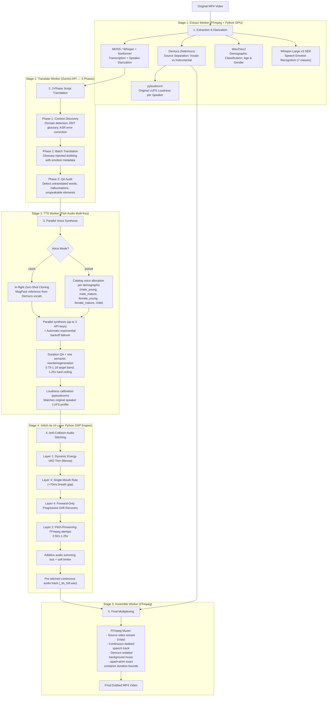

# 🎙️ Doblador - Autonomous AI Audiovisual Dubbing System

An end-to-end autonomous audiovisual dubbing platform that converts spoken videos in any language into natural, **temporally aligned** dubbed videos in Spanish (or other target languages). It preserves the original background music and sound effects while dynamically allocating cloned voices tailored to the age and gender of each detected speaker.

The pipeline maintains container synchronization (audio-to-timestamp alignment without altering the original video track).

---

## 📐 System Architecture



---

## 🧠 Artificial Intelligence Models in the Pipeline

| Model / Tool | Role / Purpose | Architecture / Type | Quantization / Weight | Runtime Device |
|---|---|---|---|---|
| **MOSS-Transcribe-Diarize** | Single-pass STT + Speaker Diarization | Audio-LLM (0.9B) | `Q5_K_M.gguf` (~667 MB) | GPU (Vulkan / GGML) |
| **Sortformer v2.1** | Multi-speaker diarization for up to 4 speakers (fallback) | Streaming Diarization Transformer | `Q8_0.gguf` (~17 MB) | GPU (Vulkan / GGML) |
| **faster-whisper (base)** | Multilingual automatic speech recognition (fallback) | Encoder-Decoder Transformer | `float16` / `int8` (~140 MB) | GPU (CUDA) / CPU |
| **Whisper-Large-v3 SER** | Speech Emotion Recognition (7 emotions: angry, disgust, fearful, happy, neutral, sad, surprised) | Whisper-Large-v3 fine-tuned audio classification (`firdhokk`) | `float16` PyTorch (~1.2 GB) | GPU (CUDA) / CPU |
| **Wav2Vec2 Age & Gender** | Gender (M/F/Child) and biological age classification | `wav2vec2-large-robust` (audEERING) | FP32 PyTorch (~1.2 GB) | CPU / GPU |
| **Demucs (htdemucs)** | Deep source separation (isolates vocals, preserves music/SFX) | Hybrid Spectrogram Waveform U-Net | FP32 PyTorch (~80 MB) | GPU (CUDA) / CPU |
| **Google Gemini Flash** | Context-aware translation & script adaptation | Multimodal Cloud LLM | `gemini-3.7-flash` (fallback to 3.5, 3.8, 3.1) | Cloud API |
| **Fish Audio (s2.1-pro-free)** | Neural voice synthesis with timbre cloning | Latent Zero-shot TTS | Remote neural engine | Cloud API (Multi-Key) |
| **pyloudnorm** | Perceptual volume calibration | ITU-R BS.1770-4 (EBU R128) | Numerical DSP | CPU |
| **Librosa + FFmpeg DSP** | Energy VAD trimming and pitch-preserving speech time-stretching | Energy VAD + `atempo` | Algorithmic DSP | CPU |

---

## ⚡ Core Engineering Innovations

### 1. 4-Layer Anti-Collision Audio Stitcher (`/stitch-tts`)
Places each synthesized TTS segment at its **original timestamp**, solving voice overlaps and cumulative timing drift:
- **Layer 1 (Dynamic VAD Trim)**: Identifies precise speech boundaries using `librosa.effects.trim(top_db=25)` to eliminate variable TTS padding without clipping words.
- **Layer 2 (Speech Time-Stretch)**: FFmpeg `atempo` adapts clip length while preserving pitch. Routine adjustment is kept inside approximately **0.92x-1.18x**, with an absolute **1.25x** ceiling.
- **Layer 3 (Strict Collision Rules)**: Every speaker is tracked independently and receives a **+70 ms** gap. Cross-speaker overlap is preserved only when it existed in the source and is capped at **250 ms**; a long TTS take cannot create a new interruption.
- **Layer 4 (Forward-Only Drift Recovery)**: Drift is never recovered by snapping timestamps backward. Subsequent clips can be accelerated up to **1.25x**; a maximum start drift above **900 ms** rejects the stage.
- **Additive Bus with Soft-Knee Limiter**: Segments are summed onto the bus (`+=`). Peaks exceeding the knee (0.80) are smoothly compressed via `tanh` up to 0.98, leaving the rest of the audio bit-identical.

### 2. Duration-Aware Translation and Two-Pass TTS
- Whisper produces word timestamps directly. The MOSS path keeps MOSS transcription/diarization and adds a Whisper word-alignment pass.
- Gemini receives the exact slot duration plus target/minimum/maximum syllable budgets for every segment.
- Generated speech is measured after synthesis. Ratios above **1.18x** or below **0.75x** trigger one meaning-preserving rewrite and TTS regeneration.
- A second result above **1.25x** fails the job instead of being rushed or clipped. Short results keep a natural pause and are expanded no further than **0.92x**.
- Successful stitching stores a per-segment synchronization report in PostgreSQL and exposes it in the UI as a downloadable JSON file.

### 3. Speech Emotion Recognition & Expressive Translation (Whisper-Large-v3 SER)
- Integrates [`firdhokk/speech-emotion-recognition-with-openai-whisper-large-v3`](https://huggingface.co/firdhokk/speech-emotion-recognition-with-openai-whisper-large-v3) running in `float16` on CUDA.
- Analyzes isolated vocal segments to detect emotional delivery across 7 classes: `angry`, `disgust`, `fearful`, `happy`, `neutral`, `sad`, `surprised`.
- Injects detected emotion tags directly into the Gemini prompt payload, guiding the translation engine to adapt cadence, rhythm, vocabulary, and punctuation (e.g. sharp exclamations for anger, vibrant colloquialisms for happiness, tender cadence for sadness).
- Persists emotion and confidence metrics to PostgreSQL and surfaces an interactive dialogue emotion timeline in the web UI.

### 4. Multi-Key Parallel Voice Synthesis with Failover (Fish Audio)
- Supports multiple API keys via `FISH_AUDIO_API_KEY`, `FISH_AUDIO_API_KEY_2`, and `FISH_AUDIO_API_KEY_3`, or comma-separated lists.
- Dispatches across **6 parallel synthesis slots** with automatic exponential backoff (2s → 30s) and jitter to handle rate limits (HTTP 429).
- Automatically rotates keys upon non-retryable errors.
- Guards against truncated or empty responses, ensuring zero dropped audio segments.

### 5. Acoustic Demographic Voice Allocation
- Analyzes each diarized speaker using `Wav2Vec2` directly on Demucs-isolated vocal stems (avoiding music/noise interference).
- Automatically assigns distinct voices from pre-configured demographic pools:
  - `male_young` (men < 45 years)
  - `male_mature` (men ≥ 45 years)
  - `female_young` (women < 45 years)
  - `female_mature` (women ≥ 45 years)
  - `child` (children < 14 years)
- Records assignments in the `speakers` table for auditability and UI inspection.

### 6. Perceptual Loudness Calibration (LUFS)
- Measures integrated LUFS of the original vocal track for each speaker using ITU-R BS.1770-4.
- Individually gains each generated TTS clip so that dubbed dialogue matches the exact perceptual loudness of the original actor.

### 6. 3-Phase Intelligent Translation Pipeline
The translate worker implements a sophisticated 3-phase architecture that dramatically improves translation quality over single-pass approaches:

- **Phase 1 — Context Discovery**: Before translating a single word, a dedicated Gemini call analyzes the full transcript to extract:
  - **Domain & Tone Detection**: Identifies the video's subject (gaming, tech, cooking, legal, etc.) and communication style (formal, comedic, energetic).
  - **DNT Glossary**: Builds a Do-Not-Translate glossary of brand names, technical terms, proper nouns, and cultural expressions with exact handling instructions (`KEEP_ORIGINAL` or `TRANSLATE_CONSISTENTLY`).
  - **ASR Error Correction**: Detects likely Whisper/MOSS transcription hallucinations (background noise misheard as words, broken idioms) and provides compensation rules for downstream translation.

- **Phase 2 — Glossary-Injected Batch Translation**: Segments are translated in batches of 35 with the Phase 1 glossary, ASR corrections, and detected domain/tone injected directly into the system instruction. Emotion metadata from Whisper-Large-v3 SER guides cadence and vocabulary choices.
  - **Full Textual Expansion**: Numbers, dates, percentages, and currencies are expanded into spoken words to prevent TTS mispronunciation.
  - **Resilient Fallback Chain**: Automatically degrades through `gemini-3.7-flash` ➔ `gemini-3.5-flash` ➔ `gemini-3.8-flash` ➔ `gemini-3.1-flash-lite` ➔ `gemini-flash-latest`.

- **Phase 3 — QA Audit**: A post-translation quality assurance pass reviews every translated segment against the original, detecting and auto-correcting:
  - Common vocabulary accidentally left untranslated.
  - Hallucinated or out-of-context words injected by the LLM.
  - Numbers or symbols not spelled out in full letters.
  - Unnecessarily wordy translations that break dubbing rhythm.

- **Graceful Degradation**: Phases 1 and 3 are fault-tolerant — if Gemini fails during context discovery or QA audit, the pipeline continues with neutral defaults instead of blocking the entire job.

### 7. In-Flight Zero-Shot Voice Cloning (Fish Audio MsgPack)
- When voice mode is set to `clone` (the default), the TTS worker extracts the clearest speech slice (≥ 1.5s) from each speaker's Demucs-isolated vocals.
- The extracted audio is sent inline as a binary MsgPack reference to Fish Audio's `s2.1-pro-free` engine, producing a zero-shot voice clone without pre-training a custom model.
- Falls back automatically to catalog preset voices if the speaker's vocal sample is too short or extraction fails.

---

## 📁 Repository Structure

```
Doblador/
├── start_system.bat         # Automated one-click startup script with health polling
├── stop_system.bat          # Clean shutdown script releasing ports and Docker
├── docker-compose.yml       # Supporting services: PostgreSQL 15 + Redis 7
├── init.sql                 # Relational database schema (jobs, stages, speakers, segments)
├── .env.example             # Global environment configuration template
│
├── frontend/                # Web UI (React 19 + TypeScript + Vite)
│   ├── src/                 # Drag & drop upload, live stage timeline, and video player
│   └── package.json
│
├── orchestrator/            # Workflow Orchestrator (Node.js + BullMQ)
│   ├── src/
│   │   ├── index.ts         # BullMQ orchestration and interrupted-job recovery
│   │   ├── server.ts        # Express API (upload, job state, download endpoints)
│   │   ├── config.ts        # Environment configuration and voice pools
│   │   ├── db.ts            # PostgreSQL connection and queries
│   │   ├── migrate.ts       # Idempotent PostgreSQL schema migrations
│   │   ├── persist.ts       # Database persistence for segments and speaker mapping
│   │   └── workers/
│   │       ├── extract.ts   # Audio extraction, Demucs, STT, diarization, duration probing
│   │       ├── translate.ts # 3-phase translation: context discovery → glossary translation → QA audit
│   │       ├── tts.ts       # Multi-key synthesis, voice cloning, demographic assignment, LUFS calibration
│   │       ├── stitch.ts    # Client for /stitch-tts continuous speech generation
│   │       └── assemble.ts  # FFmpeg assembly mixing speech with clean background
│   └── .env.example         # Orchestrator environment template
│
├── python-services/         # AI & Audio DSP Microservices (FastAPI + PyTorch)
│   ├── main.py              # Endpoints: /transcribe, /separate, /normalize-tts, /stitch-tts
│   ├── requirements.txt     # Python dependencies (faster-whisper, demucs, librosa, etc.)
│   └── venv/                # Virtual environment with CUDA/Vulkan support
│
└── scripts/
    └── prepare_ports.ps1    # Safe port cleanup script using HTTP signatures
```

---

## 🚀 Getting Started

### Prerequisites
1. **64-bit Windows 10/11** (or modern Linux/WSL2).
2. **NVIDIA GPU** with recent drivers (minimum 4 GB VRAM recommended).
3. **Docker Desktop** installed and running.
4. **Node.js 20+** and **npm**.
5. **Python 3.10 or 3.11** (64-bit).
6. **FFmpeg** installed and accessible in the system `PATH`.

### Environment Configuration
Copy `.env.example` to `orchestrator/.env` and insert your API keys:
```env
# Google Gemini API Key
GEMINI_API_KEY=your_gemini_api_key_here

# Fish Audio API Keys (supports up to 3 keys, or comma-separated in one variable)
FISH_AUDIO_API_KEY=your_first_fish_api_key
FISH_AUDIO_API_KEY_2=your_second_optional_key
FISH_AUDIO_API_KEY_3=your_third_optional_key

# Required local-service passwords (generate two long random values)
DB_PASSWORD=replace_with_a_long_random_local_password
REDIS_PASSWORD=replace_with_a_long_random_local_password
```

Operational variables (pre-configured in `.env.example`):

| Variable | Default | Purpose |
|---|---|---|
| `CORS_ORIGINS` | `http://localhost:5173,...` | Allowed web origins. API runs without auth on loopback |
| `MAX_UPLOAD_MB` | `2048` | Maximum video upload size in MB |
| `API_BIND_HOST` | `127.0.0.1` | API listening interface (keep loopback for local security) |
| `PYTHON_SERVICES_URL`| `http://127.0.0.1:8000` | Python microservice URL |
| `DB_PASSWORD` | required | Local PostgreSQL password; Docker only publishes the port on loopback |
| `REDIS_PASSWORD` | required | Local Redis password; Docker only publishes the port on loopback |

> [!NOTE]
> `.env` is explicitly ignored by `.gitignore`. Never commit your real API keys to version control.
> Existing installations must add `REDIS_PASSWORD` and replace the former default
> `DB_PASSWORD` before restarting. `start_system.bat` passes `orchestrator/.env` to
> Docker Compose so both the containers and the orchestrator use the same values.

### Starting the System
Run [`start_system.bat`](file:///c:/Users/USER/Documents/Doblador/start_system.bat) from the command line:
```cmd
start_system.bat
```
The startup sequence automatically executes:
1. **Port verification** (8000, 3000, 5173) to ensure no conflicting processes are occupying required ports.
2. Starts Docker containers (PostgreSQL on `5432` and Redis on `6379`).
3. Launches the Python microservice at `http://127.0.0.1:8000` and polls until `200 OK` is returned after GPU models load into VRAM.
4. Compiles the TypeScript orchestrator (`npm run build`) and starts the worker process on `http://127.0.0.1:3000`.
5. Launches the Vite development server for the web client at `http://localhost:5173`.

### Orchestrator Tests

From `orchestrator/`, run `npm test`. The regression suite covers Fish Audio
credential failover policy, incomplete-dialogue rejection, optional Gemini fields,
and recovery-stage selection after a restart.

### Stopping the System
To shut down all services cleanly:
```cmd
stop_system.bat
```

---

## 🛠️ API Reference

### Python Microservice (`http://127.0.0.1:8000`)

| Method | Endpoint | Parameters | Description |
|---|---|---|---|
| `GET` | `/` | None | Health check and model readiness status |
| `POST` | `/transcribe` | `file`, `engine` (`moss` / `whisper`), `age_gender_audio_path?` | Speech-to-text, diarization, word timestamps, and age/gender profiling. MOSS uses a Whisper word-alignment pass |
| `POST` | `/separate` | `file`, `output_background_path`, `output_vocals_path`, `timeout_sec?` | Demucs stem separation and original vocals LUFS measurement |
| `POST` | `/measure-speakers-loudness`| `vocals_path`, `segments_json` | Measures individual LUFS for each detected speaker |
| `POST` | `/normalize-tts` | `output_dir`, `target_lufs`, `speakers_lufs_json`, `segments_json` | Loudness calibration per speaker using pyloudnorm |
| `POST` | `/stitch-tts` | `segments_json`, `total_duration_sec`, `output_path` | Strict DSP stitching, timing quality gate, and detailed synchronization report |

### Node.js Orchestrator API (`http://127.0.0.1:3000`)

| Method | Endpoint | Description |
|---|---|---|
| `POST` | `/api/upload` | Uploads video and queues pipeline. Validates file size and extensions |
| `GET` | `/api/jobs/:id` | Returns job status, stage progress, speaker voice assignments, and segment counts |
| `GET` | `/api/jobs/:id/download` | Securely serves the finished dubbed MP4 file for a given job |
| `GET` | `/api/jobs/:id/sync-report` | Downloads the per-segment synchronization report as JSON |
| `GET` | `/api/voices` | Returns available Fish Audio voice catalogue |
| `GET` | `/api/health` | Health check endpoint returning service signature |

---

## 🗄️ Database Management

PostgreSQL migrations are executed idempotently upon orchestrator boot via `src/migrate.ts`. Pipeline recovery is coordinated by `src/index.ts`:
- `jobs.payload` preserves the latest completed stage output across process restarts.
- Existing BullMQ jobs are preserved so BullMQ can resume stalled or queued work.
- If a required stage is missing from Redis, it is reconstructed from the source video or the persisted payload and re-enqueued with a deterministic stage ID.
- Queue jobs that completed or failed before their database state was written are reconciled on startup.
- A pipeline is marked as failed only when a stage actually failed or recovery requires a payload that is unavailable.
- Granular tracking is recorded across `jobs`, `job_stages`, `speakers`, and `segments`; `jobs.sync_report` stores the final quality report.

---

## 📌 Troubleshooting

- **`ECONNREFUSED 127.0.0.1:8000`**: Heavy AI models take 10–15 seconds to load into GPU VRAM on startup. `start_system.bat` polls health automatically before launching subsequent services.
- **Gemini Rate Limits (HTTP 429/503)**: The translation worker enforces rate limiting (5 jobs/min, adjusted for 3-phase API call volume) and degrades automatically across alternative Flash models (`gemini-3.7` ➔ `3.5` ➔ `3.8` ➔ `3.1`).
- **Fish Audio Insufficient Credit (HTTP 402)**: The TTS worker detects exhausted API keys and fails the job explicitly with a descriptive error instead of producing a silent video. Rotate or recharge your Fish Audio keys to resolve.
- **cuDNN Crashes on Windows**: If you encounter `cudnnGetLibConfig` errors (Code 127), the system automatically disables cuDNN dynamic symbol lookup. This is handled in `python-services/main.py` at startup.
- **Synchronization quality gate failed**: Inspect the stage error for the segment, drift or video-boundary violation. The system intentionally does not fall back to raw `adelay`, because that would bypass collision and clipping checks.
- **Output Video Duration**: The orchestrator probes source video duration using `ffprobe` and clamps the audio mix using `apad,atrim` to match the exact container length.

---

## 📄 License

This project is licensed under the MIT License - see the [LICENSE](file:///c:/Users/USER/Documents/Doblador/LICENSE) file for details.
